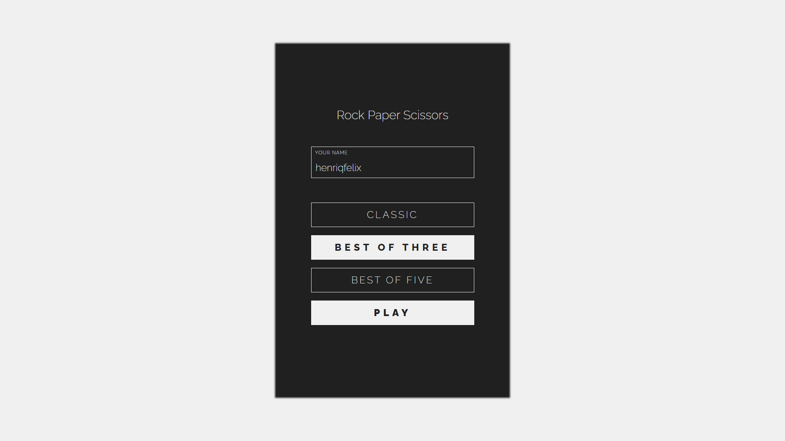
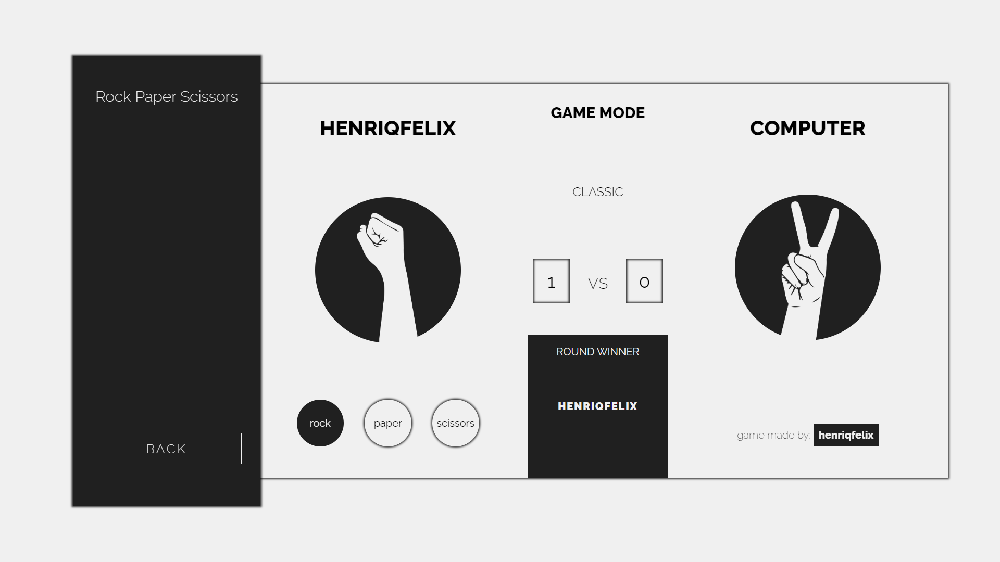
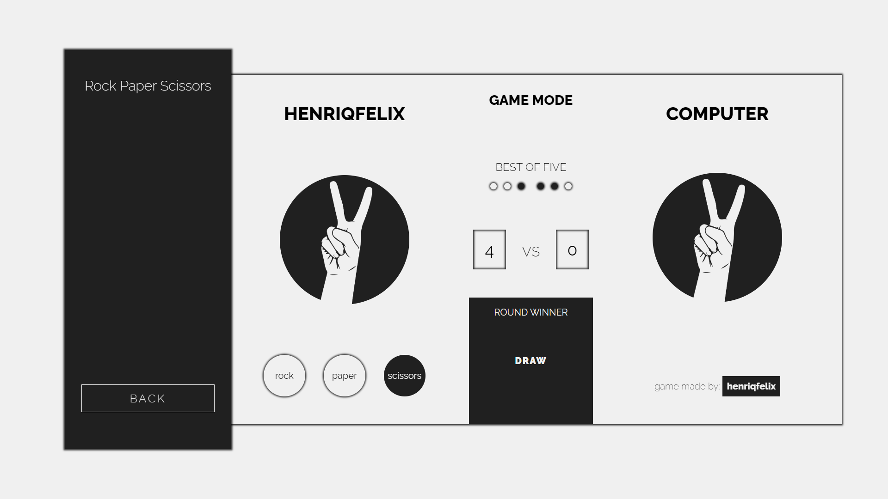

---
---

<h1 align="center"> Rock Paper Scissors </h1>

---

---

<h2 align="center"> Game </h2>

    

    *Still not compatible with mobile devices 

---

<h3 align="center">
    TRY IT YOURSELF
</h3>

    Click on the PLAY button below to be redirected to the project website.

    

---

<h3 align="center">
    Screen Menu
</h3>

    

---

<h3 align="center">
    Screen Classic Game Mode
</h3>

    

---

<h3 align="center">
    Screen Best of Three Game Mode
</h3>

    

---

<h3 align="center">
    Screen Best of Five Game Mode
</h3>

    

---

<h2> 🔥 About the project </h2>

This project is about the famous Rock Paper Scissors game. This was a personal challenge that I set myself to develop without being inspired by any other project, from the design to the source code I developed it according to the knowledge I have at the moment.
This project is one of the most important because it shows me that I'm on the right way, new challenges will come and I'm excited for the next one.

---

<h2> 🖥️ Technologies Used </h2>

- [HTML](https://www.w3.org/html/)
- [CSS](https://www.w3schools.com/css/default.asp)
- [Javascript](https://www.javascript.com)
